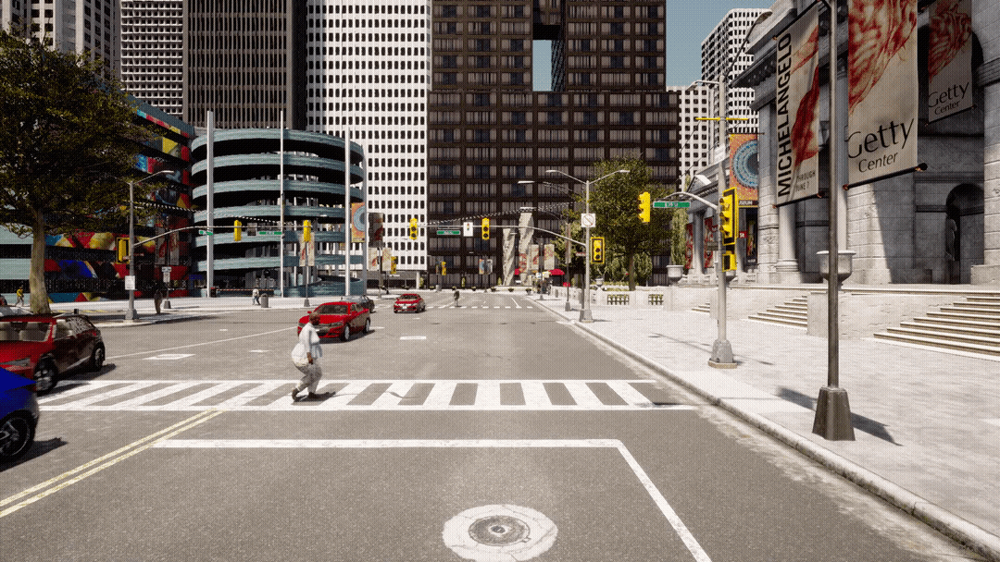
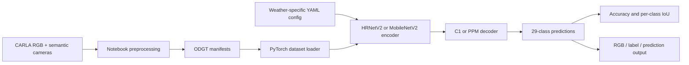

# CARLA Weather-Robust Semantic Segmentation

An academic computer-vision project that adapts [MIT CSAIL's semantic-segmentation-pytorch](https://github.com/CSAILVision/semantic-segmentation-pytorch) to study how weather affects road-scene segmentation in the CARLA simulator.

This repository is the implementation artifact from a Carleton College team capstone. It contains CARLA-specific data preparation, 29-class configurations, evaluation tooling, and experiments with mixed-weather fine-tuning. It is not presented as wholly original work: the model framework under `mit_semseg/` and much of the training infrastructure came from the upstream MIT repository. See [CONTRIBUTIONS.md](CONTRIBUTIONS.md) for the boundary between upstream and project work.


In the team's recorded fog experiment, mixed-weather fine-tuning increased mean intersection-over-union (mIoU) from **0.328 to 0.619**—an absolute gain of **0.291**. The dataset and trained checkpoints are not distributed in this repository, so the result is documented rather than claimed as a one-command reproduction.

<p align="center">
  
</p>

## What the project does

- Trains HRNetV2 + C1 and MobileNetV2 + PPM segmentation variants on CARLA images.
- Evaluates 29 CARLA semantic classes across clear day, clear night, rainy day, and foggy day conditions.
- Measures cross-weather degradation using pixel accuracy and class-level intersection-over-union.
- Tests mixed-weather fine-tuning configurations, including 10% and 30% target-weather samples.
- Produces side-by-side RGB, ground-truth, and predicted segmentation visualizations.

## System overview



## Repository layout

| Path | Purpose |
| --- | --- |
| `config/` | Weather-specific training and mixed-weather fine-tuning configurations |
| `data/` | CARLA color map and ODGT manifest generator |
| `scripts/` | Data preparation and result-analysis notebooks |
| `mit_semseg/` | Upstream segmentation framework plus project model changes |
| `train.py` | Multi-GPU training entry point |
| `eval_multipro.py` | Cross-weather evaluation and visualization entry point |
| `test.py` | Inference on an image directory |

## Installation

Training requires an NVIDIA GPU and a PyTorch build compatible with the host CUDA driver. The code imports and the CARLA model configuration are checked in CI on Python 3.10; full training is not run in CI.

```bash
git clone https://github.com/bzhao-1/carla-weather-segmentation.git
cd carla-weather-segmentation

python3.10 -m venv .venv
source .venv/bin/activate
python -m pip install --upgrade pip
python -m pip install -r requirements.txt
python -m pip install -e .
```

For GPU training, install the correct PyTorch wheel for your CUDA environment before installing the remaining requirements. See the [PyTorch installation selector](https://pytorch.org/get-started/locally/).

## Data preparation

The original experiments used four deterministic CARLA weather datasets with 1,995 images each and an 80/10/10 train/validation/test split. Those datasets are not included.

Expected local structure:

```text
new_data/
├── images/<weather>/...
├── annotations/<weather>/...
└── odgt_<weather>/
    ├── train.odgt
    ├── validate.odgt
    └── test.odgt
```

The notebooks in `scripts/` document the original preprocessing workflow. Update their input paths for your CARLA export, then ensure the generated ODGT paths match the selected file under `config/`.

For a simpler image/annotation directory, `data/odgt.py` can generate manifests directly:

```bash
python data/odgt.py --data-dir ./data --output-dir ./data
```

## Training and evaluation

Train the clear-day HRNetV2 model on GPU 0:

```bash
python train.py --gpu 0 --cfg config/ade20k-hrnetv2-CARLADAYCLEAR.yaml
```

Evaluate a checkpoint on a different weather set:

```bash
python eval_multipro.py \
  --gpus 0 \
  --cfg config/ade20k-hrnetv2-CARLADAYCLEAR.yaml \
  --test_set ./new_data/odgt_foggy_day
```

Checkpoints are expected under the `DIR` configured in the YAML file. Evaluation images are written beneath that checkpoint directory. Both data and checkpoints are ignored by Git.

## Reproducibility status

- CI parses all CARLA YAML files and verifies their paths, class counts, and required model settings.
- Python source is compiled in CI to catch syntax regressions.
- The HRNetV2 encoder and C1 decoder can be constructed with a modern PyTorch installation.
- Dataset generation now uses caller-provided paths instead of a developer-specific absolute path.
- Full metric reproduction still requires the original CARLA dataset, split manifests, GPU environment, and trained checkpoints.

## Known limitations

- This is a preserved research artifact, not a maintained production training platform.
- The checked-in notebooks describe exploratory workflows and may need adaptation to a new CARLA export.
- The exact GPU/CUDA stack from the original experiments was not recorded.
- No raw dataset or model checkpoint is redistributed.

## License and attribution

The repository retains the upstream [BSD 3-Clause license](LICENSE). Original upstream copyright remains with MIT CSAIL. The CARLA-specific work was completed as a team project at Carleton College; see [CONTRIBUTIONS.md](CONTRIBUTIONS.md) and the Git history for details.
